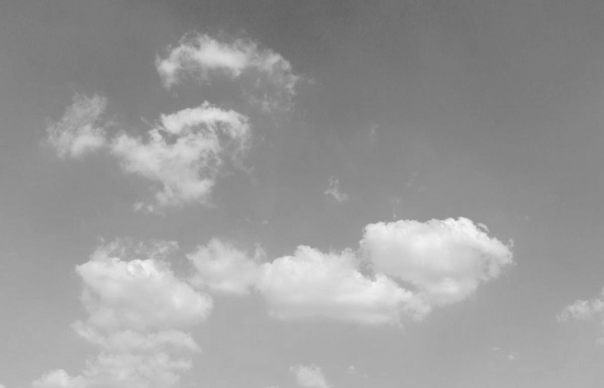

## Description

A simple script to generate a interesting png composition of two pictures. Could be used to hide some *dark secret* behind harmless peace ;-)

## Versions

### 20180811

- added first version.

## Usage

run it. no input will use default settings. drag file into it or key in the path for each image.

- adjust the brightness factor for dark image. 0 means no adjustment and 1 is total black. 0.5 is typically good practice.

### so how to see the difference?

with Chrome, you can just view the *brighter* cover within current page of readme. right click -> open image in new tab will demonstrate the *darker* background image.

## Keywords

easy | tool | PNG | composition | hide image | gray scale | 

## Theory

the composition of two images is based on gray scale values.

the brighter picture, which always serves as the 'cover' image, is overall brighter with greater average value in grayscale.

the darker picture, in contrast, hide in the background, only when alpha channel is #000000 can we see it.

assume C_1 is the grayscale value in #000(black) alpha and C_2 is in #FFF(white) alpha, then the picture can be intepreted like this:

C_1 = C * Alpha + 0 * (1 – Alpha)
C_2 = C * Alpha + 1 * (1 – Alpha)

as long as we translate(ITU-R 601-2 or plain average) the two pictures into gray scale mode, we can hereto acquire the C and Alpha for the output image. be aware! both C and Alpha cannot exceed 255.

loop through all the pixels or vectorize the loop to get output image!
